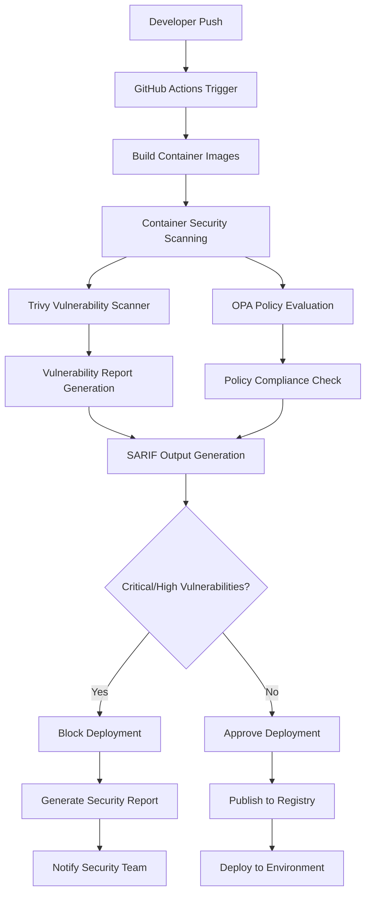

# AutoAudit Container Security Scanning Implementation

## Project Overview

This repository contains the comprehensive implementation of container security scanning capabilities for AutoAudit's CI/CD pipeline infrastructure. The system provides enterprise-grade vulnerability detection, automated policy enforcement, and compliance validation capabilities that align with SOC 2 Type II requirements and support AutoAudit's strategic positioning as a security-first compliance assessment platform.

## Architecture Overview



## Key Features

### Comprehensive Vulnerability Detection
- **Multi-Database Scanning**: Integrates with National Vulnerability Database, GitHub Security Advisories, and commercial vulnerability intelligence feeds
- **Real-Time Analysis**: Scanning completion times under 3 minutes for standard container images
- **CVSS 3.1 Scoring**: Automated vulnerability severity classification with risk assessment
- **Software Bill of Materials**: Generates SPDX and CycloneDX format SBOMs for all scanned containers

### Advanced Policy Enforcement
- **Open Policy Agent Integration**: Declarative security policies using Rego language
- **Hierarchical Policy Management**: Organisation-wide baseline policies with project-specific customisations
- **Compliance Framework Alignment**: Built-in support for CIS Docker Benchmark, NIST Cybersecurity Framework
- **Exception Management**: Formal risk acceptance workflow for approved vulnerabilities

### Enterprise-Grade Security
- **Zero-Trust Architecture**: Identity verification, device trust validation, application authorisation
- **End-to-End Encryption**: AES-256 data-at-rest, TLS 1.3 data-in-transit encryption
- **Comprehensive Audit Logging**: Tamper-evident audit records for all scanning activities
- **Network Isolation**: Dedicated VPC with restricted ingress/egress for scanning infrastructure

## Quick Start Guide

### Prerequisites

Before implementing the container security scanning system, ensure the following prerequisites are met:

- **GitHub Repository**: Administrative access to AutoAudit GitHub repositories
- **Docker Hub Account**: Registry access for container image management
- **Cloud Provider Account**: AWS, Azure, or GCP for infrastructure provisioning
- **Terraform >= 1.6.0**: Infrastructure as Code provisioning tool
- **kubectl >= 1.28.0**: Kubernetes cluster management (if applicable)

### Installation Steps

1. **Clone the Repository**
   ```bash
   git clone https://github.com/hardhat-enterprises/autoaudit-container-security.git
   cd autoaudit-container-security
   ```

2. **Configure Environment Variables**
   ```bash
   cp .env.example .env
   # Edit .env file with your specific configuration
   export GITHUB_TOKEN="your_github_token"
   export DOCKER_REGISTRY="your_registry_url"
   export CLOUD_PROVIDER="aws|azure|gcp"
   ```

3. **Initialise Infrastructure**
   ```bash
   cd infrastructure/terraform
   terraform init
   terraform plan -var-file="environments/dev.tfvars"
   terraform apply -var-file="environments/dev.tfvars"
   ```

4. **Deploy Scanning Components**
   ```bash
   cd ../../deployment
   ./deploy-scanning-infrastructure.sh --environment dev
   ```

5. **Configure GitHub Actions Workflows**
   ```bash
   cp .github/workflows/container-scanning-template.yml .github/workflows/container-scanning.yml
   # Customise the workflow for your specific repository structure
   ```

### Configuration Management

The system utilises configuration-as-code principles with environment-specific settings managed through Terraform variables and GitHub Actions secrets.

#### Security Policy Configuration
```yaml
# policies/vulnerability-policy.rego
package autoaudit.security

# Critical vulnerabilities block deployment
deny[msg] {
    input.vulnerabilities[_].severity == "CRITICAL"
    msg := "Critical vulnerabilities detected - deployment blocked"
}

# High vulnerabilities require approval
warn[msg] {
    input.vulnerabilities[_].severity == "HIGH"
    msg := "High severity vulnerabilities detected - requires security team approval"
}
```

#### Scanning Profile Configuration
```yaml
# config/scanning-profiles.yaml
profiles:
  development:
    scanner: "trivy"
    timeout: "300s"
    severity_threshold: "HIGH"
    policy_enforcement: "warn"
  
  production:
    scanner: "trivy"
    timeout: "600s" 
    severity_threshold: "MEDIUM"
    policy_enforcement: "strict"
```

## System Components

### Core Scanning Engine (`src/scanner/`)

The scanning engine implements modular vulnerability detection capabilities with pluggable scanner backends and intelligent result processing.

#### Primary Components:
- **Scanner Orchestrator**: Manages scanning workflow execution and result aggregation
- **Vulnerability Processor**: Normalises scanner outputs and applies risk scoring
- **Policy Evaluator**: Executes OPA policies against scanning results
- **Report Generator**: Produces comprehensive vulnerability and compliance reports

### Policy Management Framework (`src/policies/`)

The policy framework provides flexible, declarative security policy definition and enforcement capabilities.

#### Key Features:
- **Rego Policy Engine**: Utilises Open Policy Agent for policy evaluation
- **Policy Testing Framework**: Automated validation for policy modifications
- **Version Control Integration**: Git-based policy distribution and versioning
- **Exception Management**: Formal approval workflow for vulnerability exceptions

### Infrastructure Components (`infrastructure/`)

The infrastructure implementation utilises Terraform for reproducible, version-controlled infrastructure provisioning.

#### Infrastructure Modules:
- **Scanning Infrastructure**: Dedicated compute resources for vulnerability scanning
- **Network Security**: VPC configuration with security group restrictions
- **Storage Systems**: Encrypted storage for vulnerability databases and scan results
- **Monitoring Stack**: Prometheus, Grafana, and alerting infrastructure

### GitHub Actions Integration (`.github/workflows/`)

The CI/CD integration provides seamless scanning capabilities embedded within existing development workflows.

#### Workflow Components:
- **Container Build**: Optimised container image building with layer caching
- **Security Scanning**: Automated vulnerability detection with policy enforcement
- **Result Processing**: Comprehensive report generation and distribution
- **Deployment Gates**: Automated deployment approval based on security posture

## Security Architecture

### Defense-in-Depth Implementation

The system implements comprehensive security controls across multiple layers ensuring robust protection against diverse threat scenarios.

#### Network Security
- **VPC Isolation**: Dedicated Virtual Private Cloud with restrictive networking
- **Security Groups**: Ingress/egress rules limiting network communication
- **Network Monitoring**: Real-time analysis of network traffic patterns
- **DDoS Protection**: Cloud provider DDoS mitigation services

#### Data Protection
- **Encryption at Rest**: AES-256 encryption for all stored data
- **Encryption in Transit**: TLS 1.3 for all network communications
- **Key Management**: Cloud provider KMS with automated key rotation
- **Backup Encryption**: Encrypted backup storage with cross-region replication

#### Access Control
- **Multi-Factor Authentication**: Required for all administrative access
- **Role-Based Access Control**: Granular permissions based on job functions
- **Service Accounts**: Minimal privilege service account management
- **Audit Logging**: Comprehensive logging for all access activities

### Compliance Framework Alignment

The implementation aligns with multiple regulatory frameworks and industry standards ensuring enterprise readiness and audit compliance.

#### Supported Frameworks:
- **SOC 2 Type II**: Comprehensive controls for security, availability, and confidentiality
- **ISO 27001**: Information security management system requirements
- **NIST Cybersecurity Framework**: Core security functions and implementation guidance
- **CIS Controls**: Critical security controls implementation and validation

## Performance Optimisation

### Scanning Performance

The system implements multiple optimisation techniques ensuring rapid scanning completion without compromising detection accuracy.

#### Optimisation Strategies:
- **Parallel Processing**: Multi-threaded scanning across container image layers
- **Intelligent Caching**: Vulnerability database caching with smart invalidation
- **Incremental Scanning**: Delta analysis for container image modifications
- **Resource Allocation**: Dynamic scaling based on scanning queue depth

### Infrastructure Scaling

The architecture supports horizontal and vertical scaling ensuring adequate capacity during peak development periods.

#### Scaling Capabilities:
- **Horizontal Scaling**: Automatic provisioning of additional scanning resources
- **Load Balancing**: Intelligent distribution of scanning workloads
- **Resource Optimisation**: Automatic resource cleanup and optimisation
- **Capacity Planning**: Predictive scaling based on historical usage patterns

## Monitoring and Observability

### Comprehensive Monitoring Framework

The system implements extensive monitoring capabilities providing visibility into scanning operations, security posture, and system performance.

#### Monitoring Components:
- **Prometheus Metrics**: Custom metrics for scanning performance and security events
- **Grafana Dashboards**: Real-time visualisation of system health and security metrics
- **Alerting Rules**: Proactive alerting for critical security and operational events
- **Distributed Tracing**: End-to-end tracing for scanning workflow analysis

### Security Event Monitoring

The security monitoring framework provides comprehensive threat detection and incident response capabilities.

#### Security Monitoring Features:
- **Vulnerability Trend Analysis**: Historical trending of security posture improvements
- **Policy Violation Detection**: Real-time detection of security policy violations
- **Anomaly Detection**: Machine learning-based detection of unusual scanning patterns
- **Incident Correlation**: Automated correlation of security events across system components

## Development Guidelines

### Code Quality Standards

All code contributions must adhere to established quality standards ensuring maintainability, security, and performance.

#### Quality Requirements:
- **Test Coverage**: Minimum 90% code coverage for all components
- **Security Scanning**: Automated security scanning for all code contributions
- **Code Review**: Mandatory peer review with security team approval
- **Documentation**: Comprehensive inline documentation and README updates

### Security Development Practices

Development activities must follow secure coding practices ensuring system security and vulnerability prevention.

#### Security Practices:
- **Threat Modeling**: Comprehensive threat analysis for new features
- **Security Testing**: Automated and manual security testing procedures
- **Vulnerability Management**: Systematic handling of identified security issues
- **Security Training**: Regular security training for development team members

## API Documentation

### Scanning API Endpoints

The system provides RESTful APIs for programmatic access to scanning capabilities and result retrieval.

#### Core Endpoints:
- `POST /api/v1/scan/container`: Initiate container image scanning
- `GET /api/v1/scan/{scan-id}/results`: Retrieve scanning results
- `POST /api/v1/policies/validate`: Validate security policies
- `GET /api/v1/metrics/security`: Retrieve security metrics

### Authentication and Authorisation

API access requires authentication and appropriate authorisation for endpoint access.

#### Authentication Methods:
- **API Keys**: Service-to-service authentication with rotating keys
- **OAuth 2.0**: User authentication with scope-based authorisation
- **JWT Tokens**: Short-lived tokens for session management
- **Certificate Authentication**: Client certificate authentication for high-security scenarios

## Troubleshooting Guide

### Common Issues and Solutions

#### Scanning Timeout Issues
```bash
# Increase timeout values in configuration
export SCANNER_TIMEOUT=600
# Optimise container image layers
docker build --squash -t image:tag .
```

#### Policy Evaluation Failures
```bash
# Validate policy syntax
opa fmt --diff policies/
# Test policies against sample data
opa test policies/ --verbose
```

#### Network Connectivity Problems
```bash
# Verify security group configurations
terraform show | grep security_group
# Test network connectivity
telnet scanner-endpoint 443
```

### Support and Escalation

For technical support and issue escalation, utilise the following resources:

- **Internal Documentation**: Comprehensive troubleshooting in `/docs/troubleshooting/`
- **Security Team**: Contact the Security Assessment and Vulnerability Assessment team for security-related issues
- **DevOps Team**: Contact the DevSecOps and Infrastructure team for infrastructure issues
- **Emergency Response**: 24/7 escalation through on-call procedures

## Contributing Guidelines

### Development Process

All contributions must follow established development processes ensuring code quality, security, and system stability.

#### Contribution Steps:
1. **Issue Creation**: Create GitHub issue describing proposed changes
2. **Branch Creation**: Create feature branch from main development branch
3. **Development**: Implement changes following coding standards
4. **Testing**: Execute comprehensive testing including security validation
5. **Pull Request**: Submit pull request with detailed description and testing evidence
6. **Code Review**: Undergo peer review and security team approval
7. **Merge**: Merge approved changes following deployment procedures

### Documentation Requirements

All code contributions must include comprehensive documentation ensuring system maintainability and knowledge transfer.

#### Documentation Standards:
- **Inline Comments**: Detailed comments explaining complex logic
- **README Updates**: Updated README files for new components
- **API Documentation**: OpenAPI specifications for new endpoints
- **Architecture Decisions**: Documented rationale for architectural changes

### Third-Party Dependencies

The system utilises various open-source components subject to their respective licenses:

- **Trivy**: Apache License 2.0
- **Open Policy Agent**: Apache License 2.0
- **Terraform**: Mozilla Public License 2.0
- **Prometheus**: Apache License 2.0

## Version History

### v1.0.0 (Current)
- Initial implementation of container security scanning
- Integration with GitHub Actions CI/CD pipeline
- Trivy vulnerability scanner integration
- Open Policy Agent policy enforcement
- Comprehensive monitoring and alerting